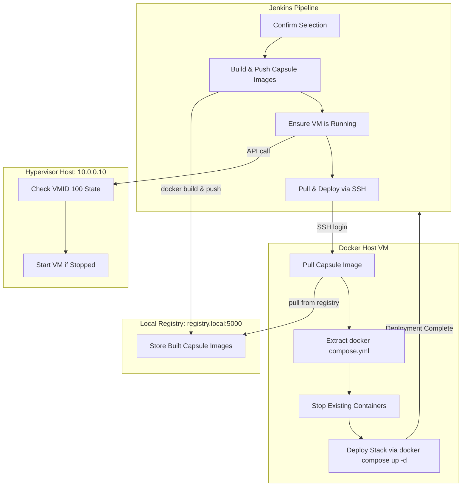

# CapsuleDeploy
### Self-contained CI/CD system for modular, image-based capsule deployments

This Jenkins pipeline automates the full **build → push → deploy** process for your self-hosted services.

Each service lives in its own folder with a lightweight **Dockerfile** and **docker-compose.yml**.  
When built, the image becomes a **self-contained deployment capsule**, carrying its own compose and logic inside it.  
The pipeline builds those images, pushes them to a **local registry**, ensures the target **hypervisor VM** is running, and then deploys each stack remotely via SSH.

---

## Core Concept

Every service folder in the repo acts like a "deployer capsule":
- `Dockerfile` defines how to build the image.
- `docker-compose.yml` defines how to run it.
- The image contains its own compose file and deployment logic.
- Jenkins builds and pushes it; the VM later pulls and deploys it directly.

Each image is **self-sufficient**:
- It knows how to deploy itself.
- It carries its own configuration.
- It doesn’t rely on git clones or extra scripts on the target host.

---

## Architecture Overview



---

## Prerequisites

| Component | Description | Example |
|------------|--------------|---------|
| **Jenkins** | Installed with pipeline support | `apt install jenkins` |
| **Hypervisor Host** | API access enabled | `10.0.0.10` |
| **Local Docker Registry** | Private LAN registry | `registry.local:5000` |
| **Docker Host VM** | Runs containers | VM ID `100` on hypervisor |
| **Credentials in Jenkins** |  |  |
| `infra-api-creds` | API token or user/password |  |
| `registry-creds` | Docker registry credentials |  |
| `ssh-prod` | SSH key for Docker VM |  |

---

## Repository Structure

```
.
├── Jenkinsfile
├── n8n/
│   ├── Dockerfile
│   └── docker-compose.yml
├── portainer/
│   ├── Dockerfile
│   └── docker-compose.yml
└── whoami/
    ├── Dockerfile
    └── docker-compose.yml
```

Each folder represents one deployable service stack.

---

## Pipeline Parameters

| Parameter | Options | Description |
|------------|----------|-------------|
| **SERVICE** | `n8n`, `portainer`, `whoami`, `all` | Which service(s) to deploy |
| **ENVIRONMENT** | `dev`, `staging`, `prod` | Target environment |
| **RUN TYPE** | `Deploy`, `Build and Deploy` | Choose whether to rebuild or just redeploy |

---

## How It Works

1. **Confirm Selection**  
   Jenkins logs your chosen parameters.

2. **Build & Push** (optional)  
   - Builds self-contained Docker images ("deployment capsules") for selected services.  
   - Injects environment variables (for example, LAN_IP).  
   - Pushes the images to the local registry.

3. **Ensure VM is Running**  
   - Uses the hypervisor API to start the target VM (by VMID) if it’s powered off.

4. **Pull & Deploy**  
   - SSHs into the Docker host.  
   - Logs into the registry, pulls the latest images.  
   - Extracts the embedded `docker-compose.yml` from each image.  
   - Stops old containers and brings up the new stack using `docker compose up -d`.

---

## Example Run

**Deploy n8n to Production (build + deploy)**

```
SERVICE = n8n
ENVIRONMENT = prod
RUN TYPE = Build and Deploy
```

Steps:
1. Builds `registry.local:5000/n8n:latest`
2. Pushes to local registry
3. Starts VM `100`
4. SSH deploys with compose extraction and restart

---

## Example Service Folder

**n8n/Dockerfile**
```dockerfile
FROM docker:27.0.3-cli-alpine3.20
RUN apk add --no-cache docker-cli-compose bash
WORKDIR /app
COPY . /app
ARG LAN_IP
ENV LAN_IP=$LAN_IP

CMD ["docker", "compose", "up", "-d"]
```

**n8n/docker-compose.yml**
```yaml
version: "3.9"
services:
  n8n:
    image: n8nio/n8n:latest
    ports:
      - "5678:5678"
    environment:
      - N8N_BASIC_AUTH_ACTIVE=true
      - N8N_BASIC_AUTH_USER=admin
      - N8N_BASIC_AUTH_PASSWORD=secret
```

Each built image acts as a self-contained deployment capsule.  
It can be run directly to deploy its own stack, or used by Jenkins to extract its embedded compose file for automated deployment.

---

## Why It Works

| Principle | Implementation |
|------------|----------------|
| **Modular** | Each service is self-contained. |
| **Portable** | No git dependencies after build. |
| **Offline-ready** | Uses local registry and LAN network. |
| **Extensible** | Add a new service folder to add a new stack. |

---

## Future Enhancements

- Semantic versioning (for example `:v1.0.0`)
- Rollback and compose history
- Deployment metadata (timestamp, commit hash)
- Health checks after deployment

---

## Credits

Built by **gustav0thethird**  
For those who automate not just their systems, but their environment.

> "Hold my beer, I am deploying."
