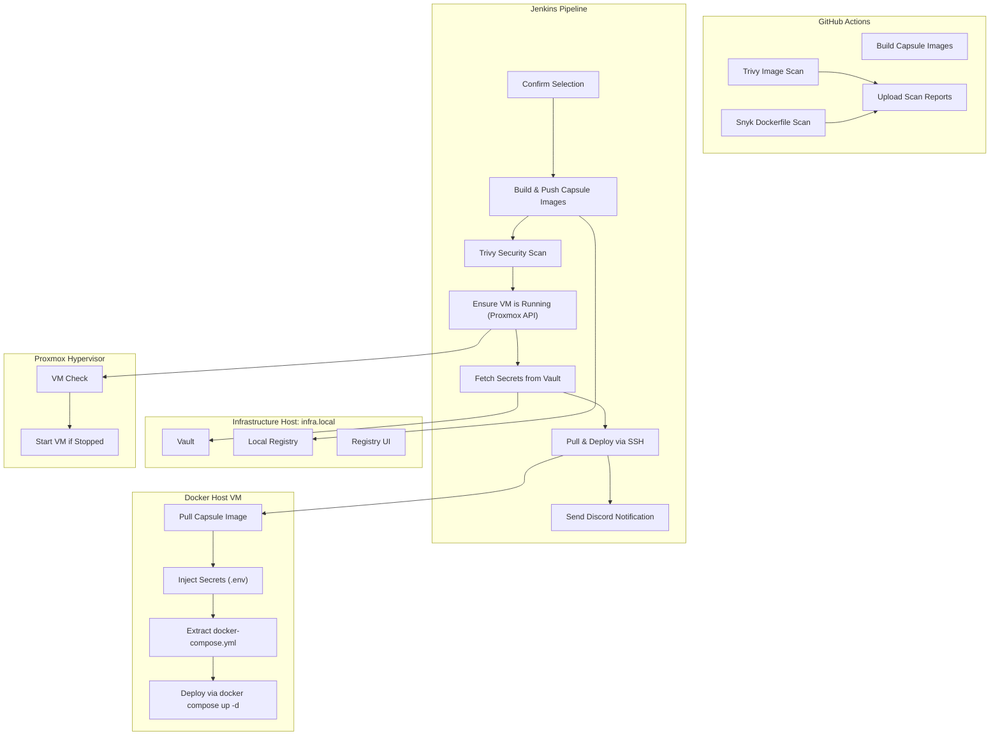

# CapsuleBay  
[](https://github.com/gustav0thethird/CapsulBay/actions/workflows/CI.yml)
[](https://github.com/gustav0thethird/CapsuleBay/actions/workflows/snyk.yml)
### Self-contained hybrid CI/CD system for modular, image-based capsule deployments with Vault-based secret management and integrated security scanning  

> “Where each service carries its own deployment logic.”  
> Build once. Scan everywhere. Deploy with confidence.


---

CapsuleBay is a hybrid CI/CD framework built around self-contained deployment capsules — Docker images that embed their own `docker-compose.yml` and configuration logic.  

It automates your entire **build → push → scan → deploy** pipeline across both GitHub Actions and Jenkins, combining:  
- Vault-based secret management  
- Per-service modular builds  
- Immutable image capsules  
- Automated VM lifecycle via Proxmox API  
- Security scanning via Trivy and Snyk  
- Discord notifications with status, build link, duration, and timestamp  

---

## Overview

Each service in the repository acts as a capsule — a fully self-contained deployment unit with:  
- Its own Dockerfile  
- Its own docker-compose.yml  
- No dependency on repo scripts or Git state  

When built, the capsule image:
1. Embeds its `docker-compose.yml` inside itself.  
2. Is tagged, versioned, and pushed to a local registry.  
3. Is deployed remotely by Jenkins with Vault-injected secrets.  
4. Is scanned for vulnerabilities before deployment.  
5. Notifies the team via Discord with build link, timestamps, and status.

---

## System Architecture

CapsuleBay is divided into two CI/CD layers:

### 1. GitHub Actions – Cloud Validation Layer
Runs automatically on every push or pull request:
- Builds capsule images for validation.  
- Runs Trivy image scans (HIGH and CRITICAL severity).  
- Runs Snyk Dockerfile scans for dependency-level issues.  
- Uploads scan reports as artifacts for review.  

This ensures all commits are secure, compliant, and buildable before hitting Jenkins.

### 2. Jenkins – Self-Hosted Deployment Layer
Handles controlled, Vault-secured deployments within your LAN:
- Builds, tags, and pushes capsule images to your local registry.  
- Retrieves secrets dynamically from Vault.  
- Ensures the target VM is powered on (via Proxmox API).  
- Scans built images again using Trivy.  
- Deploys capsules remotely with embedded `docker-compose.yml`.  
- Sends Discord notifications with service, environment, build link, duration, and timestamp.

---

## Architecture Diagram



---

## Getting Started

### 1. Deploy the Core Infrastructure
```bash
cd infra
sudo ./setup.sh
```

This script:
- Detects your LAN IP automatically.  
- Creates a `.env` and `.secrets` file with generated credentials.  
- Deploys Vault, Registry, and an optional Registry UI.  

After setup, you’ll have:

| Service | Purpose | URL |
|----------|----------|-----|
| Vault | Secret storage for Jenkins & services | `http://<LAN_IP>:8200` |
| Registry | Local image registry | `http://<LAN_IP>:5000` |
| Registry UI | Optional web dashboard | `http://<LAN_IP>:5001` |

Initialize Vault:
```bash
docker exec -it vault vault operator init
docker exec -it vault vault operator unseal <key>
```

---

## Repository Structure

```
.
├── Jenkinsfile                  # Main CapsuleBay pipeline
├── .github/workflows/           # Cloud-side validation
│   ├── capsulebay-build.yml     # Trivy image validation
│   └── snyk-dockerfile.yml      # Snyk Dockerfile scanning
├── infra/                       # Local infrastructure setup
│   ├── setup.sh
│   └── docker-compose.yml
├── n8n/
│   ├── Dockerfile
│   └── docker-compose.yml
├── portainer/
│   ├── Dockerfile
│   └── docker-compose.yml
└── whoami/
    ├── Dockerfile
    └── docker-compose.yml
```

Each directory (except `infra/`) is a self-contained capsule.

---

## Adding a New Capsule

Adding a new service is as simple as:

1. Create a folder, e.g. `myservice/`.  
2. Add a `Dockerfile` and `docker-compose.yml`.  
3. Add the folder name to the Jenkins `SERVICE` parameter list.  

CapsuleBay automatically:
- Builds and pushes the capsule image.  
- Scans it for vulnerabilities.  
- Retrieves secrets from Vault.  
- Deploys it remotely on the correct VM.

No pipeline edits. No extra scripts. Plug, build, and deploy.

---

## Pipeline Parameters

| Parameter | Options | Description |
|------------|----------|-------------|
| SERVICE | `n8n`, `portainer`, `whoami`, `all` | Which stack(s) to deploy |
| ENVIRONMENT | `dev`, `staging`, `prod` | Target environment and Vault path |
| RUN_TYPE | `Deploy`, `Build and Deploy` | Choose whether to rebuild or redeploy only |

---

## Vault Example

```bash
vault secrets enable -path=secret kv-v2
vault kv put secret/n8n/dev N8N_BASIC_AUTH_USER=admin N8N_BASIC_AUTH_PASSWORD=supersecret
vault kv get secret/n8n/dev
```

Secrets are injected automatically into each `.env` file during deployment.

---

## Example Capsule

**n8n/Dockerfile**
```dockerfile
FROM docker:27.0.3-cli-alpine3.20
RUN apk add --no-cache docker-cli-compose bash
WORKDIR /app
COPY . /app
ARG LAN_IP
ENV LAN_IP=$LAN_IP
CMD ["docker", "compose", "up", "-d"]
```

**n8n/docker-compose.yml**
```yaml
version: "3.9"
services:
  n8n:
    image: n8nio/n8n:latest
    ports:
      - "5678:5678"
    env_file:
      - .env
```

---

## Security Stack

CapsuleBay integrates layered security checks:

| Layer | Tool | Purpose |
|--------|------|----------|
| GitHub Actions (pre-merge) | Trivy | Scan built images for vulnerabilities |
| | Snyk | Scan Dockerfiles for dependency CVEs |
| Jenkins (pre-deploy) | Trivy CLI | Rescan final image before deployment |
| Vault | HashiCorp Vault | Securely manage and deliver secrets |
| Discord | Webhook alerts | Send success or failure messages with build link |

---

## Discord Notifications

At the end of each pipeline run, CapsuleBay sends a Discord embed containing:
- Service name  
- Environment  
- Build link (e.g. `[Build #42](https://jenkins.example.local/job/CapsuleBay/42/)`)  
- Duration  
- Timestamp  
- User ping (`<@UserID>`)  

**Example:**
> CapsuleBay Deployment Successful  
> Service: portainer  
> Environment: prod  
> Build: [#42](https://jenkins.example.local/job/CapsuleBay/42/)  
> Duration: 2m 34s  
> Timestamp: 2025-10-26 20:42  

---

## Why CapsuleBay Works

| Principle | Implementation |
|------------|----------------|
| Immutable Infrastructure | Each service is a versioned, self-contained capsule |
| Decentralized Secrets | Vault-managed environment injection |
| Hybrid CI/CD | GitHub Actions (validation) + Jenkins (execution) |
| Offline Ready | Works entirely within LAN or air-gapped systems |
| Auditable & Repeatable | Logged builds, scans, and deployments |
| Actionable Alerts | Discord embeds include build link, duration, and timestamp |

---

## Credits

Built by **gustav0thethird**  
For those who automate not just their systems — but their environment.

> “Hold my beer, I am deploying.”
