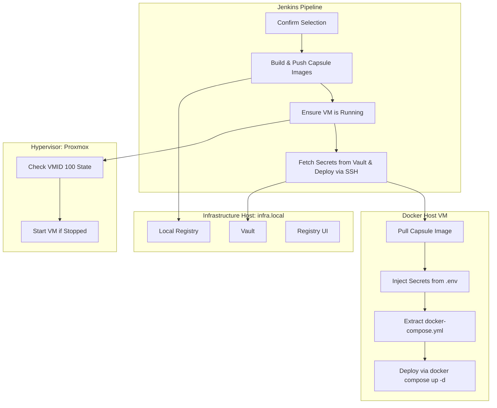

# CapsuleBay
### Self-contained CI/CD system for modular, image-based capsule deployments with Vault-based secret management  

> *“Where each service carries its own deployment logic.”*  
> Build once. Push anywhere. Deploy with confidence.


---

CapsuleBay is a **Jenkins-driven pipeline** that automates the full **build → push → deploy** process for your self-hosted services.

Each service lives in its own folder as a lightweight **deployment capsule** — a self-contained unit with its own Dockerfile and docker-compose.yml.  
When built, the image becomes an **immutable capsule** that carries its own deployment logic and configuration inside it.  
The pipeline builds those capsules, pushes them to a **local registry**, ensures the target **hypervisor VM** is running, securely retrieves environment secrets from **Vault**, and deploys each stack remotely via SSH.

---

## Getting Started

Before using the Jenkins pipeline, you must set up the core CapsuleBay infrastructure.  
This includes **Vault**, a **local Docker registry**, and an optional **Registry UI** — all deployed using Docker Compose.

Navigate to the `infra/` folder and run the setup script:

```bash
cd infra
sudo ./setup.sh
```

This script will:
- Detect your LAN IP automatically.
- Generate a `.env` file with environment variables for Vault and Registry.
- Create a `.secrets` file with auto-generated credentials.
- Bring up the full backend stack using `docker-compose.yml` in the same directory.

After it completes, you’ll have the following services running locally:

| Service | Purpose | URL |
|----------|----------|-----|
| **Vault** | Secret storage for Jenkins and services | `http://<LAN_IP>:8200` |
| **Registry** | Private image registry for your deployment capsules | `http://<LAN_IP>:5000` |
| **Registry UI** | Web interface for browsing your local images | `http://<LAN_IP>:5001` |

You can override any environment values before running setup by editing the generated `.env` file or exporting variables directly:

```bash
LAN_IP=192.168.1.100 JENKINS_USER=ciuser ./setup.sh
```

Once complete, follow the output instructions to initialize Vault:

```bash
docker exec -it vault vault operator init
docker exec -it vault vault operator unseal <key>
```

Then log in via the web interface at `http://<LAN_IP>:8200`.

---

## Core Concept

Every service folder in the repo acts like a “deployment capsule”:
- `Dockerfile` defines how to build the capsule image.
- `docker-compose.yml` defines how to run it.
- The built image carries its own deployment logic.
- Jenkins builds, signs, and pushes it to the registry.
- The target host pulls, decrypts, and deploys it directly using Vault for secrets.

Each capsule is **self-sufficient**:
- Carries its own configuration logic.
- Pulls all environment secrets dynamically from Vault.
- Deploys without depending on Git or additional scripts.

---

## Architecture Overview



---

## Prerequisites

| Component | Description | Example |
|------------|--------------|---------|
| **Jenkins** | Installed with plugins + credentials | `apt install jenkins`  or via a Docker container on another or the same host |
| **Infrastructure Host** | Proxmox or similar hypervisor with API access | `infra.local` |
| **Local Docker Registry** | Deployed via `infra/setup.sh` | `registry.local:5000` |
| **Vault** | Deployed via `infra/setup.sh` | `vault.local:8200` |
| **Docker Host VM** | Runs container stacks | VM ID `100` |
| **Credentials in Jenkins** | API, registry, SSH, and Vault access |  |

---

## Repository Structure

```
.
├── Jenkinsfile
├── infra/
│   ├── setup.sh
|   └──docker-compose.yml
│   
├── n8n/
│   ├── Dockerfile
│   └── docker-compose.yml
├── portainer/
│   ├── Dockerfile
│   └── docker-compose.yml
└── whoami/
    ├── Dockerfile
    └── docker-compose.yml
```

Each directory bar Infra represents a self-contained deployment capsule.

---

## 🧩 Adding New Services

CapsuleBay is designed to scale linearly — adding a new service requires **no pipeline rewrites**.

To add a new deployment capsule:
1. Create a new folder (e.g. `myservice/`).
2. Add a minimal `Dockerfile` and `docker-compose.yml`.
3. Update the Jenkins pipeline **SERVICE** parameter options.

That’s it — Jenkins will automatically:
- Build and push the new capsule to your local registry.
- Retrieve environment secrets dynamically from Vault.
- Deploy it remotely using the same flow as existing services.

> ⚡ No extra scripts. No manual integration. Just plug, build, and deploy.

---

## Pipeline Parameters

| Parameter | Options | Description |
|------------|----------|-------------|
| **SERVICE** | `n8n`, `portainer`, `whoami`, `all` | Which service(s) to deploy |
| **ENVIRONMENT** | `dev`, `staging`, `prod` | Target environment and Vault path |
| **RUN_TYPE** | `Deploy`, `Build and Deploy` | Choose whether to rebuild or just redeploy |

---

## Example Vault Setup

```bash
vault secrets enable -path=secret kv-v2
vault kv put secret/n8n/dev N8N_BASIC_AUTH_USER=admin N8N_BASIC_AUTH_PASSWORD=supersecret
vault kv get secret/n8n/dev
```

---

## Example Service Capsule

**n8n/Dockerfile**
```dockerfile
FROM docker:27.0.3-cli-alpine3.20
RUN apk add --no-cache docker-cli-compose bash curl jq
WORKDIR /app
COPY . /app
ARG LAN_IP
ENV LAN_IP=$LAN_IP
CMD ["docker", "compose", "up", "-d"]
```

**n8n/docker-compose.yml**
```yaml
version: "3.9"
services:
  n8n:
    image: n8nio/n8n:latest
    ports:
      - "5678:5678"
    env_file:
      - .env
```

Vault delivers the `.env` dynamically per deployment, ensuring **no secrets exist in the repo or images**.

---

## Why It Works

| Principle | Implementation |
|------------|----------------|
| **Decentralized Secrets** | Managed centrally via Vault |
| **Modular Deployment** | Each service is a self-contained capsule |
| **Immutable Artifacts** | Each build produces a versioned capsule image |
| **Offline-Ready** | Operates entirely within LAN using local registry and Vault |
| **Auditable & Repeatable** | Every deployment is logged and versioned through Jenkins |

---

## Credits

Built by **gustav0thethird**  
For those who automate not just their systems, but their environment.

> "Hold my beer, I am deploying."
