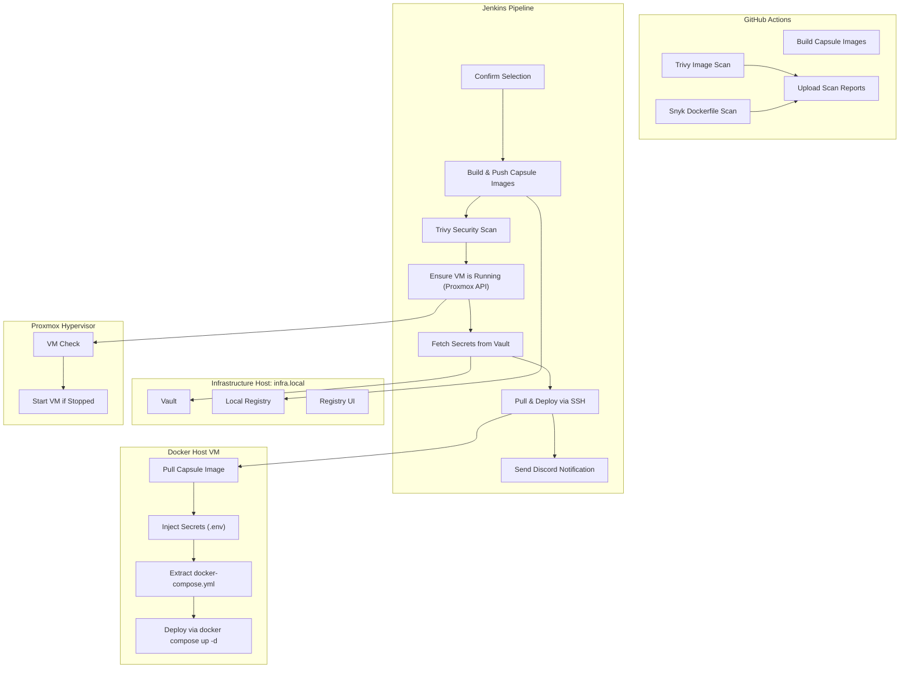

# System Architecture

CapsuleBay is structured around a two-layer CI/CD architecture that integrates both cloud-based and self-hosted components to facilitate modular, image-based deployments.

## 1. GitHub Actions – Cloud Validation Layer

This layer operates automatically on every push or pull request to ensure code integrity and security before deployment:

- **Builds Capsule Images**: Each service's Docker image is built for validation.
- **Trivy Image Scans**: Conducts security scans focusing on HIGH and CRITICAL vulnerabilities.
- **Snyk Dockerfile Scans**: Analyzes Dockerfiles for dependency-level vulnerabilities.
- **Artifact Uploads**: Scan reports are uploaded as artifacts for review.

This layer ensures that all commits are secure, compliant, and buildable prior to reaching the Jenkins deployment layer.

## 2. Jenkins – Self-Hosted Deployment Layer

The Jenkins layer manages controlled deployments within a local area network (LAN), utilizing Vault for secure secret management:

- **Builds, Tags, and Pushes Capsule Images**: Capsule images are built and pushed to a local registry.
- **Dynamic Secret Retrieval**: Secrets are fetched from Vault dynamically during the deployment process.
- **VM Lifecycle Management**: Ensures that the target virtual machine (VM) is powered on using the Proxmox API.
- **Final Image Scans**: Conducts a secondary scan of the built images using Trivy.
- **Remote Deployments**: Deploys the capsules using the embedded `docker-compose.yml`.
- **Discord Notifications**: Sends notifications to the team with details about the deployment status, including service name, environment, build link, duration, and timestamp.

## Architecture Diagram

## Summary

The CapsuleBay architecture effectively combines cloud-based validation with self-hosted deployment, ensuring a secure and efficient CI/CD pipeline. Each layer plays a critical role in maintaining the integrity and security of the deployment process, allowing for modular and scalable service management.
