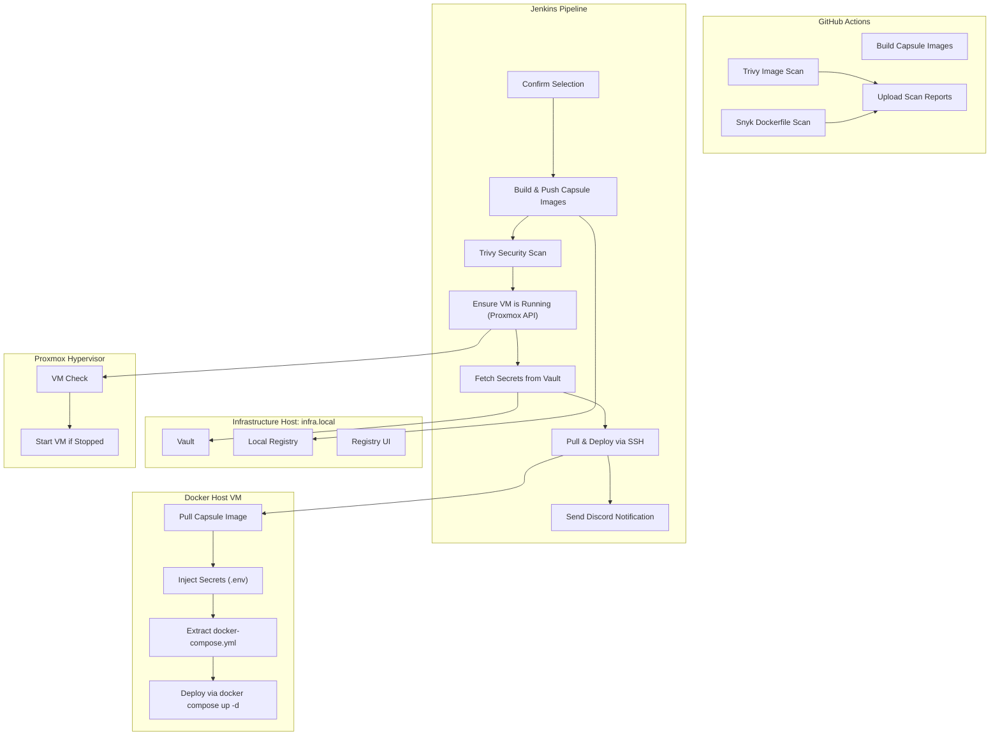

# System Architecture

CapsuleBay is divided into two CI/CD layers:

### 1. GitHub Actions – Cloud Validation Layer
This layer runs automatically on every push or pull request and is responsible for:
- Building capsule images for validation.
- Running Trivy image scans to identify vulnerabilities with HIGH and CRITICAL severity.
- Executing Snyk Dockerfile scans to detect dependency-level issues.
- Uploading scan reports as artifacts for review.

This process ensures that all commits are secure, compliant, and buildable before they reach the Jenkins deployment layer.

### 2. Jenkins – Self-Hosted Deployment Layer
This layer manages controlled, Vault-secured deployments within your local area network (LAN). Its responsibilities include:
- Building, tagging, and pushing capsule images to a local registry.
- Dynamically retrieving secrets from Vault.
- Ensuring the target virtual machine (VM) is powered on using the Proxmox API.
- Performing a second security scan on built images using Trivy.
- Deploying capsules remotely with their embedded `docker-compose.yml`.
- Sending Discord notifications that include service details, environment, build link, duration, and timestamp.

---

## Architecture Diagram

---

## Summary

CapsuleBay's architecture leverages both GitHub Actions for cloud-based validation and Jenkins for self-hosted deployments, ensuring a robust and secure CI/CD pipeline. Each layer plays a critical role in maintaining the integrity and security of the deployment process, from initial code validation to final deployment.
